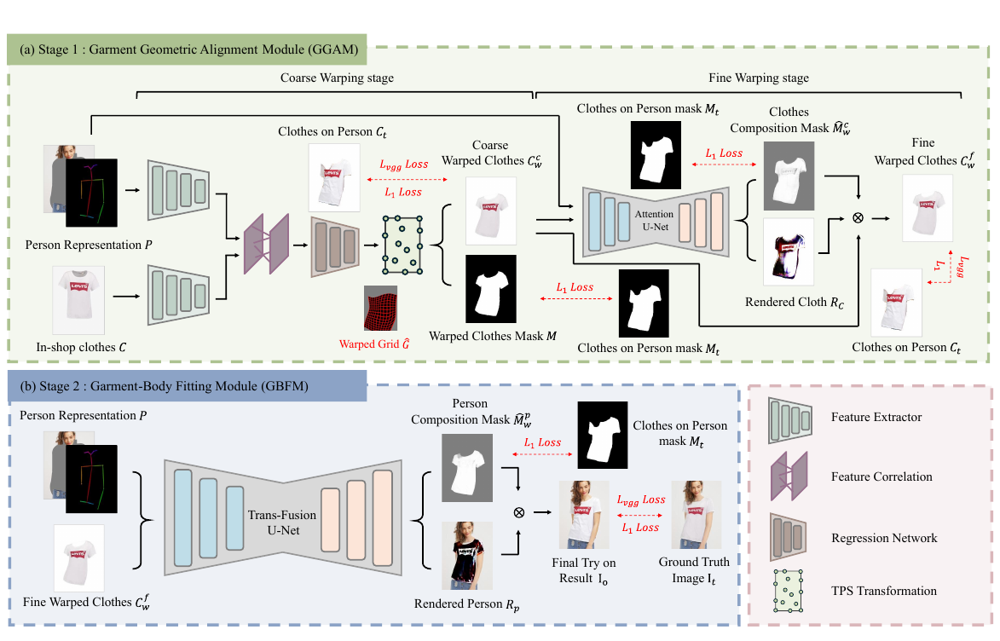
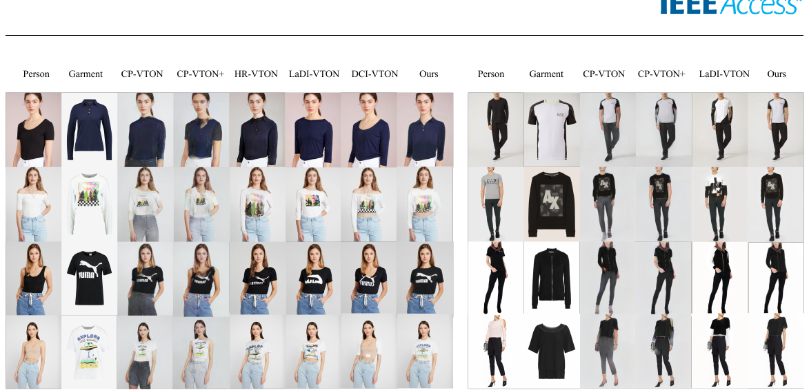

# Dual-stage Virtual Try-on

### Geometric Refinement and Multi-scale Feature Integration

**의상을 신체에 맞게 정렬하면서 원본의 무늬와 로고를 보존하고, 의상과 신체를 자연스럽게 합성하는 두 단계 가상 착용 모델 연구입니다.**

이미지 생성 결과의 실패 원인을 정렬 오류, 의상 디테일 손실, 경계 합성 오류로 나누고, 각 원인을 해결하는 모듈을 설계해 비교 실험과 ablation으로 검증했습니다.

**제1저자:** 이혜빈 / Hyebean Lee  
**논문:** *Dual-Stage Detail-Preserving Virtual Try-On Network With Geometric Refinement and Multi-Scale Feature Integration*, IEEE Access, vol. 13, pp. 88557-88572, 2025.  
[IEEE 논문](https://ieeexplore.ieee.org/document/11005534/) | [모델 구조와 코드](docs/architecture.md) | [실행 안내](docs/reproduction.md) | [추가로 필요한 자료](docs/missing-assets.md)

> 이 저장소는 제공된 연구 코드를 정리한 버전입니다. GMM의 해상도 의존 계층을 수정해 256 x 192와 논문 해상도인 512 x 384를 지원하며, 두 크기의 텐서 실행을 확인했습니다. 학습 가중치와 당시의 정확한 실험 설정은 포함되지 않았습니다. 아래 성능은 논문에 보고된 수치로, 이 저장소에서 새로 재현한 결과가 아닙니다.

## 연구에서 수행한 일

- **문제 분석:** 최종 이미지와 단계별 결과를 비교해 정렬, 특징 보존, 합성 경계의 문제를 분리했습니다.
- **모델 설계와 구현:** TPS 이후 Attention U-Net으로 의상을 보정하고, 합성 단계에는 self-attention, 다중 해상도 특징 융합, cross-attention을 결합한 Trans-Fusion U-Net을 구성했습니다.
- **실험 검증:** 두 벤치마크의 정량 평가와 시각적 비교를 수행하고, 구성 요소를 제거하는 실험으로 각 설계의 효과를 확인했습니다.
- **논문 작성:** 연구 내용과 실험 결과를 정리해 제1저자로 논문을 작성했습니다.

## 해결한 문제와 설계

| 실패 유형 | 설계 | 확인할 코드 |
| --- | --- | --- |
| 어깨선과 소매의 정렬 오류 | TPS로 전체 형태를 정렬한 뒤 Attention U-Net으로 국소 영역 보정 | `GMM_networks.py`, `GMM_network_Unet.py` |
| 변형 과정에서 무늬와 로고 손실 | coarse warping 결과와 보정 결과를 마스크로 결합 | `train.py`, `test.py`의 GMM 처리 |
| 의상과 신체의 부자연스러운 경계 | Trans-Fusion U-Net으로 의상과 신체의 관계를 반영한 합성 | `TOM_Fusion_GT_U_Transformer.py` |



논문의 Figure 2. GGAM은 정렬, GBFM은 최종 합성을 담당합니다. 코드에서는 각각 `GMM`과 `TOM`이라는 이름을 사용합니다.

**GGAM:** 의상과 인물 표현의 특징을 비교해 TPS 변형을 추정합니다. 이후 Attention U-Net이 RGB 보정 결과와 결합 마스크를 예측해 세부 정렬을 보완합니다.

**GBFM:** 인물 표현과 정렬된 의상을 입력받습니다. Group-wise self-attention encoder, Multi-scale Feature Fusion, Cross-attention decoder를 결합해 인물 RGB와 마스크를 출력합니다. 이 마스크로 정렬된 의상과 인물 출력을 결합합니다.

## 논문에 보고된 결과

실험 해상도: **512 x 384 (높이 x 너비)**. DressCode는 **상의 데이터**를 사용했습니다. KID는 표의 값 그대로 표시했습니다. 제공된 평가 스크립트는 KID에 1000을 곱해 출력합니다.

| 데이터셋 | Paired SSIM ↑ | Paired LPIPS ↓ | Paired FID ↓ | Paired KID ↓ | Unpaired FID ↓ | Unpaired KID ↓ |
| --- | ---: | ---: | ---: | ---: | ---: | ---: |
| VITON-HD | 0.8480 | 0.0618 | 7.61 | 1.80 | 9.99 | 2.33 |
| DressCode-Upper | 0.9300 | 0.0285 | 7.91 | 1.13 | 11.27 | 1.69 |

출처: 논문의 Table 1. 비교 대상 중 FID, KID, LPIPS에서 개선을 보고했습니다. VITON-HD의 SSIM은 일부 비교 모델보다 낮아 모든 지표에서 최고 성능을 달성한 것은 아닙니다.



논문의 Figure 5. 무늬와 로고의 보존, 신체 정렬, 합성 경계를 비교하는 예시입니다. 위 이미지는 논문 결과이며 현재 정리된 코드로 새로 생성한 이미지가 아닙니다.

### 구성 요소 검증

GGAM에서는 TPS 단독, TPS + Standard U-Net, TPS + Attention U-Net을 시각적으로 비교했습니다. GBFM에서는 encoder, fusion, decoder의 각 구성 요소를 제거해 효과를 확인했습니다.

| GBFM 구성 (VITON-HD, unpaired) | FID ↓ | KID ↓ |
| --- | ---: | ---: |
| Group-wise Self-Attention Encoder 제거 | 9.9824 | 2.3480 |
| Multi-scale Feature Fusion 제거 | 9.8986 | 2.2362 |
| Cross-Attention Decoder 제거 | 10.1698 | 2.5102 |
| 전체 구성 | 9.8470 | 2.2040 |

출처: 논문의 Table 2. Table 1과 Table 2의 전체 모델 수치는 다르므로 각 표의 실험 결과를 구분해 기재했습니다. 현재 실행 경로에는 전체 모델을 사용합니다. 제거 실험의 원본 후보는 `archive/original/`에 보존했으며, Table 2 전체와의 코드 대응은 미확인입니다.

## 코드 탐색

| 경로 | 내용 |
| --- | --- |
| `train.py`, `test.py` | GMM / TOM 학습과 추론 진입점 |
| `GMM_networks.py`, `GMM_network_Unet.py` | TPS 정렬과 Attention U-Net 보정 |
| `TOM_Fusion_GT_U_Transformer.py` | 전체 Trans-Fusion U-Net |
| `TOM_network_GT_U_Net.py` | Group-wise self-attention encoder |
| `TOM_network_U_Net_Transformer.py` | Cross-attention decoder |
| `TOM_network_Fusion_u_net_utils.py` | TOM의 convolution과 fusion 공통 계층 |
| `cp_dataset.py` | 현재 DressCode 형식의 데이터 로더 |
| `eval.py`, `eval_utils.py` | FID, KID, SSIM, LPIPS 평가 |
| `tools/check_assets.py` | 실행 전에 데이터, 마스크, 가중치 경로를 점검 |
| `archive/original/` | 드라이브에서 가져온 32개 원본 파일 |
| `docs/` | 모델 대응, 실행 절차, 누락 자료, 검증 범위 |

## 실행 전 확인

Python 3.10 환경을 기준으로 의존성 후보를 정리했습니다. 연구 원본의 학습 환경을 복원한 lockfile은 아니며, GPU에서의 전체 실행은 아직 검증되지 않았습니다.

```bash
python -m venv .venv
source .venv/bin/activate
python -m pip install -r requirements.txt

python tools/check_assets.py \
  --dataroot data/Dresscode-512 --datamode test \
  --fine_height 512 --fine_width 384 \
  --data_list test_pairs_paired_modified.txt --stage GMM \
  --checkpoint checkpoints/gmm/gmm_final.pth --check-env
```

가중치와 전처리된 데이터가 준비되면 [실행 안내](docs/reproduction.md)의 순서대로 GMM 추론, 정렬 이미지 전달, TOM 추론을 진행합니다. CUDA GPU가 필요합니다. 데이터셋과 가중치는 Git에 포함하지 않습니다.

## 검증 상태와 출처

Python 문법 검사와 15개 테스트를 수행했습니다. 두 해상도의 GMM 전체 forward, 회귀 계층과 TPS 역전파, 데이터 로딩 및 checkpoint 저장과 로딩을 CPU에서 확인했습니다. 256 회귀 계층은 동일 가중치에서 원본과 출력이 일치합니다. 실제 학습 가중치의 호환성, GPU 학습과 추론, 논문 성능 재현은 미확인입니다. [검증 기록과 수정 범위](docs/validation.md)에서 확인할 수 있습니다.

기존 CP-VTON 기반 코드와 외부 모델의 구성 요소를 활용했습니다. 연구의 기여는 각 구성 요소를 과제에 맞게 수정하고 두 단계 모델로 설계해 실험한 데 있습니다. 원본 `LICENSE`와 코드의 출처 표기는 유지했습니다. [참고 구현과 출처](THIRD_PARTY_NOTICES.md)를 참고하세요.
